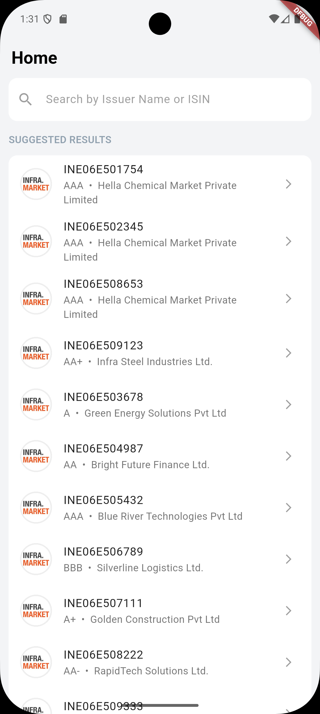
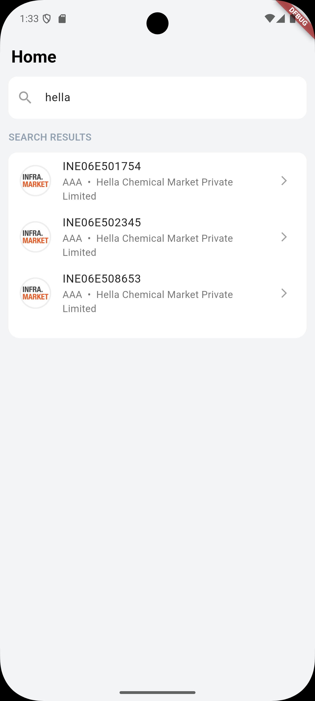
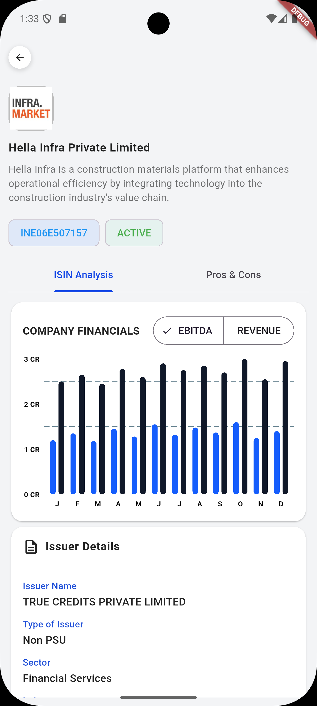
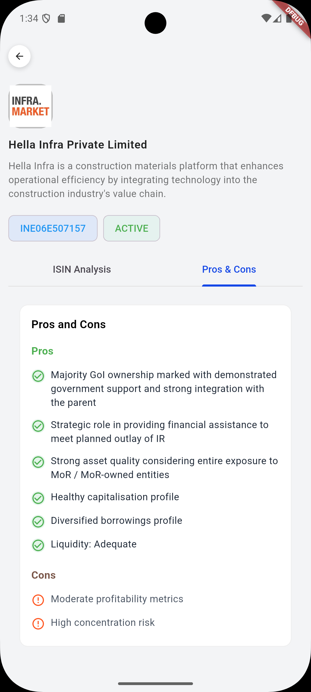

# Tap Invest Assessment

[Project Live - Demo](https://tap-invest-eta.vercel.app/)

## Note to Evaluator

- This project uses `HydratedBloc` instead of plain `flutter_bloc` for state persistence.
- Due to limited time and smaller project scope, the Clean Architecture layers have been simplified.
- **Entities** and **Use Cases** are skipped intentionally to reduce boilerplate and improve demo clarity.

---

## Subtle Consideration / Future Enhacements
+ Strings / Themes / Constants based seperate Utility class to keep the code discrete.
+ onSearched UI Highlighter to showcase matched records
+ Chart / Graph UI Enhacements

## Screenshots

## References
Figma Link - [Figma](https://www.figma.com/design/d9OgnsIY95YaUZw5XJbXyE/Flutter-2?node-id=0-1&p=f&t=CRx3plSXxaiUfi4J-0)

